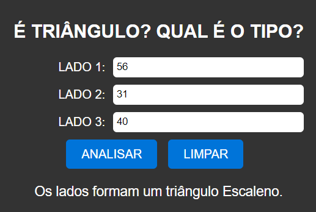

# VERIFICADOR DE TRIÂNGULO
游꾔ERIFICADOR DE TRIÂNGULO EM HTML, CSS E JS.

  

## DESCRIÇÃO:
Este é um verificador de triângulos que determina se os valores fornecidos podem formar um triângulo e, caso positivo, identifica o tipo de triângulo formado (equilátero, isósceles ou escaleno). Aqui estão as principais funcionalidades implementadas:

1. Entrada de Lados:
   - O usuário pode inserir os comprimentos dos três lados do triângulo nos campos designados.

2. Verificação de Triângulo:
   - Ao clicar no botão "ANALISAR", o programa verifica se os valores fornecidos podem formar um triângulo.
   - Se os valores satisfazem a condição de existência de um triângulo (a soma de dois lados é sempre maior que o terceiro lado), o programa identifica o tipo de triângulo formado (equilátero, isósceles ou escaleno).
   - Caso contrário, uma mensagem é exibida informando que os valores não formam um triângulo.

   - Abaixo está uma tabela para os tipos de triângulos:

   | Tipo de Triângulo | Descrição                                          |
   |-------------------|----------------------------------------------------|
   | Equilátero        | Triângulo com todos os lados e ângulos iguais.    |
   | Isósceles         | Triângulo com dois lados iguais e um diferente.   |
   | Escaleno          | Triângulo com todos os lados e ângulos diferentes.|

   - Esta tabela fornece uma breve descrição de cada tipo de triângulo com base na relação entre os comprimentos dos lados.

3. Limpar:
   - O botão "LIMPAR" permite ao usuário limpar os campos de entrada e o resultado, facilitando a entrada de novos valores.

## EXECUTANDO O PROJETO:
1. Inserir Comprimentos dos Lados:
   - Insira os comprimentos dos três lados do triângulo nos campos "LADO 1", "LADO 2" e "LADO 3".

2. Analisar Triângulo:
   - Clique no botão "ANALISAR" para verificar se os valores fornecidos formam um triângulo e qual é o tipo de triângulo formado.

3. Limpar Campos:
   - Se desejar limpar os campos de entrada e o resultado, clique no botão "LIMPAR".
   - Isso removerá qualquer entrada anterior e resultado da tela.

## NÃO SABE?
- Entendemos que para manipular arquivos em `HTML`, `CSS` e outras linguagens relacionadas, é necessário possuir conhecimento nessas áreas. Para auxiliar nesse aprendizado, oferecemos cursos gratuitos disponíveis:
* [CURSO DE HTML E CSS](https://github.com/VILHALVA/CURSO-DE-HTML-E-CSS)
* [CURSO DE JAVASCRIPT](https://github.com/VILHALVA/CURSO-DE-JAVASCRIPT)
* [CONFIRA MAIS CURSOS](https://github.com/VILHALVA?tab=repositories&q=+topic:CURSO)

## CREDITOS:
- [PROJETO CRIADO PELO VILHALVA](https://github.com/VILHALVA)
- [ESTÁ DISPONIVEL NO SITE](https://vilhalva.github.io/STYLER/STYLER.html)

